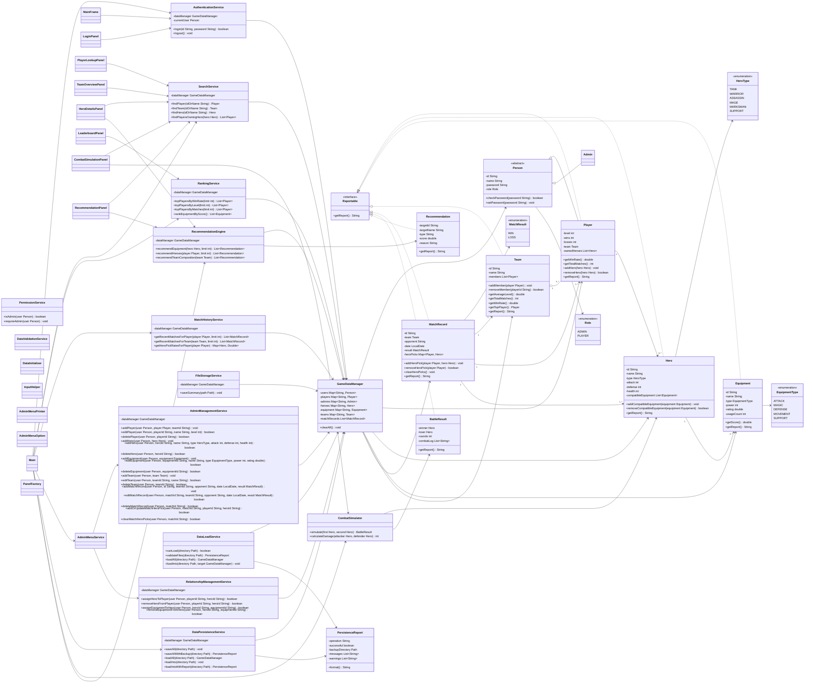

# Honor of Kings IMS - Complete Project Plan

## 1. Project Goal

This project implements an AI-assisted Information Management System for Honor of Kings. The system is a Java application with a stable console interface for the core coursework requirements and implemented extra-credit modules for recommendation, combat simulation, GUI, enhanced persistence, and advanced AI reflection documentation.

The system has two user roles:

- Admin: can log in, manage all major data, save and load data, and maintain relationships between players, heroes, equipment, teams, and match records.
- Player: can log in, view personal information, edit limited personal information, view owned heroes and match history, and view public hero, team, equipment, and leaderboard information.

The project demonstrates Java OOP design, responsible AI use, meaningful Git history, testing evidence, and complete documentation.

## 2. Requirement Analysis

### 2.1 Player Lookup

Users can search a player by ID or name. The system displays:

- player ID and name;
- team;
- level and win rate;
- owned heroes;
- each hero's compatible equipment.

Implementation plan:

- `SearchService.findPlayer()` searches by ID or partial name.
- `Player.getReport()` displays core player statistics.
- `Main.showPlayerLookup()` prints owned heroes and equipment.

### 2.2 Team Overview

Users can search a team by ID or name. The system displays:

- team name;
- all members;
- average level;
- total matches;
- win rate;
- top player.

Implementation plan:

- `SearchService.findTeam()` locates the team.
- `Team` calculates average level, total matches, win rate, and top player.
- `Main.showTeamOverview()` prints the team report and member reports.

### 2.3 Hero Details

Users can search a hero by ID or name. The system displays:

- hero name and type;
- attack, defense, and health;
- compatible equipment;
- players who own the hero;
- recommended equipment from the implemented recommendation module.

Implementation plan:

- `SearchService.findHero()` locates the hero.
- `SearchService.findPlayersOwningHero()` finds owners.
- `RecommendationEngine.recommendEquipment()` provides recommendations as an extra-credit feature.

### 2.4 Equipment Statistics

Equipment is ranked by a documented score:

```text
score = usageCount * 2 + rating + power / 100
```

Implementation plan:

- `Equipment.getScore()` calculates the score.
- `RankingService.rankEquipmentByScore()` sorts equipment.
- `Main.showEquipmentStatistics()` prints the ranking and formula.

### 2.5 Match History

Users can retrieve the last N matches for a player or team. The system displays:

- opponent;
- date;
- result;
- heroes picked;
- win/loss record;
- hero pick rate for player history.

Implementation plan:

- `MatchHistoryService.getRecentMatchesForPlayer()` and `getRecentMatchesForTeam()` sort records by date.
- `MatchHistoryService.getPlayerWinLossSummary()` and `getTeamWinLossSummary()` calculate win/loss records.
- `MatchHistoryService.getHeroPickRatesForPlayer()` calculates pick rates.
- `MatchRecord` stores `Map<Player, Hero>` hero picks.

### 2.6 Leaderboard

Users can display top X players by:

- win rate;
- level;
- number of matches.

Tie handling:

```text
selected metric -> win rate -> level -> name
```

Implementation plan:

- `RankingService.topPlayersByWinRate()`
- `RankingService.topPlayersByLevel()`
- `RankingService.topPlayersByMatches()`
- `Main.showLeaderboard()` lets the user choose the metric.

### 2.7 Data Management

Admin users can add, edit, and delete:

- players;
- heroes;
- equipment;
- teams;
- match records.

Admin users can also manage relationships:

- assign/remove hero for player;
- assign/remove equipment for hero;
- add/update/clear match hero picks.

Player users can:

- view their own information;
- edit limited personal information;
- view heroes and match history;
- view public hero, team, equipment, and leaderboard information.

Implementation plan:

- `AdminMenuService` handles admin menu input and routes actions.
- `AdminManagementService` handles CRUD operations.
- `RelationshipManagementService` handles player-hero and hero-equipment links.
- `PermissionService` protects admin-only actions.
- `PlayerSelfService` supports player self-service actions.

### 2.8 Authentication

The system includes:

- Admin login;
- Player login;
- logout;
- current-user tracking;
- role-based permission checks.

Implementation plan:

- `AuthenticationService` checks credentials and stores the current user as `Person`.
- `PermissionService` checks role permissions.

### 2.9 Initial Dataset

The dataset contains:

- 3 teams, each with 5 players;
- 15 players, each owning at least 3 heroes;
- 15 heroes, each able to use at least 2 equipment items;
- 20 equipment items;
- 10 match records.

Implementation plan:

- `DataInitializer.createSampleData()` creates sample data at startup.
- `GameDataManager` stores users, players, heroes, equipment, teams, and match records.

## 3. Extra-Credit Feature Implementation

### 3.1 Combat Simulation

PDF feature:

Implement a turn-based battle simulator using hero stats, equipment, random factors, critical hit or dodge, win/loss result, and a combat report.

Implementation:

- Add `model.BattleResult`.
- Add `service.CombatSimulator`.
- Add a console menu option under admin or public tools.
- User selects two heroes by ID or name.
- Simulator calculates equipment bonus from compatible equipment.
- Each round alternates attacker and defender.
- Damage formula:

```text
damage = max(1, attackerAttack + equipmentBonus - defenderDefense * 0.4)
```

- Critical hit:

```text
10% chance, damage * 1.5
```

- Dodge:

```text
8% chance, damage = 0
```

- `BattleResult.getReport()` prints round-by-round combat log, winner, loser, and remaining health.

### 3.2 Recommendation Engine

PDF feature:

Recommend heroes or equipment based on hero type, player preference, win rate, equipment usage, or team composition.

Implementation:

- Add `model.Recommendation`.
- Add `service.RecommendationEngine`.
- Equipment recommendation uses:

```text
recommendationScore = equipmentScore + heroTypeCompatibilityBonus + usageBonus
```

- Hero recommendation uses missing role coverage:
  - if a player lacks tanks, recommend a tank;
  - if a player lacks support, recommend a support;
  - otherwise recommend high-stat heroes not owned by the player.
- Team recommendation checks whether a team has at least one tank, one mage, one marksman, one assassin/warrior, and one support.
- `Hero Details` shows recommended equipment.
- The recommendation menu and GUI recommendation panel show equipment, hero, and team recommendations.

### 3.3 GUI

PDF feature:

Implement a GUI using Swing or JavaFX supporting at least player lookup, team overview, hero details, and leaderboard.

Implementation:

- Use Swing to avoid external dependencies.
- Add `gui.MainFrame`.
- Add panels:
  - `LoginPanel`;
  - `PlayerLookupPanel`;
  - `TeamOverviewPanel`;
  - `HeroDetailsPanel`;
  - `LeaderboardPanel`;
  - `CombatSimulationPanel`;
  - `RecommendationPanel`.
- GUI uses existing service classes instead of duplicating logic.
- Console mode remains the primary stable mode, and startup mode also allows direct GUI launch.

### 3.4 Data Persistence

PDF feature:

Save and load data using text files, CSV files, JSON files, or JDBC database.

Implementation:

- `DataPersistenceService.saveAll()` saves structured CSV files.
- `DataLoadService.loadInto()` loads structured CSV files back into `GameDataManager`.
- `FileStorageService.saveSummary()` exports a readable summary.

- Invalid-row and missing-file reporting is handled by `DataLoadService` and `PersistenceReport`.
- Backup folder support is implemented:

```text
data/backups/
```

- Startup detects saved CSV data and informs admins that option 10 can load it.

### 3.5 Advanced AI Reflection

PDF feature:

Compare two different AI models or two different agent roles solving the same problem.

Implementation plan:

- Complete this in `ai/reflection.md`.
- Compare at least two roles:
  - Implementation Agent;
  - Testing/Reviewer Agent.
- Use the match record hero pick bug as the comparison topic.
- Compare:
  - correctness;
  - readability;
  - edge-case coverage;
  - fit with existing code;
  - learning value.

## 4. Java Concepts Used

- Inheritance: `Player` and `Admin` extend abstract `Person`.
- Encapsulation: fields are private and accessed through controlled methods.
- Association: `Player` owns heroes; `Hero` uses equipment; `MatchRecord` links players and hero picks.
- Aggregation: `Team` contains players.
- Interface: `Reportable` is used by reportable domain classes.
- Polymorphism: the logged-in user is stored as `Person`; reports can be handled through `Reportable`.
- Collections: `List`, `Map`, `ArrayList`, and `LinkedHashMap` store system data.
- Exception handling: invalid input, duplicate IDs, missing records, file errors, and date parsing errors are handled.
- File I/O: `FileStorageService`, `DataPersistenceService`, and `DataLoadService` save/load text and CSV files.
- Enums: `Role`, `HeroType`, `EquipmentType`, and `MatchResult`.

## 5. Class Design

### 5.1 Model Classes

- `Person`: abstract superclass for users.
- `Player`: game player with level, win/loss data, team, and owned heroes.
- `Admin`: user with management permission.
- `Hero`: playable hero with type, stats, and compatible equipment.
- `Equipment`: item with type, power, rating, usage count, and score.
- `Team`: group of players with team statistics.
- `MatchRecord`: match result with team, opponent, date, result, and hero picks.
- `BattleResult`: extra-credit model for combat simulation results.
- `Recommendation`: extra-credit model for recommendation output.

### 5.2 Service Classes

- `GameDataManager`: central storage and data-management service.
- `AuthenticationService`: login, logout, and current-user state.
- `PermissionService`: admin/player permission checks.
- `SearchService`: player, team, hero, owner, and match-history search.
- `RankingService`: player leaderboard and equipment ranking.
- `MatchHistoryService`: recent matches, win/loss summary, and hero pick rate.
- `AdminManagementService`: admin CRUD operations.
- `AdminMenuService`: admin menu input routing.
- `RelationshipManagementService`: player-hero and hero-equipment relationship management.
- `FileStorageService`: readable data summary output.
- `DataPersistenceService`: structured CSV save/load entry point, backup workflow, and persistence reports.
- `DataLoadService`: structured CSV loading and validation.
- `PersistenceReport`: save/load operation report.
- `RecommendationEngine`: extra-credit recommendations.
- `CombatSimulator`: extra-credit battle simulation.

### 5.3 Utility and GUI Classes

- `DataInitializer`: required initial dataset.
- `InputHelper`: console input helper.
- `AdminMenuOption`: admin menu options.
- `AdminMenuPrinter`: admin menu display.
- `MainFrame`, `LoginPanel`, `PlayerLookupPanel`, `TeamOverviewPanel`, `HeroDetailsPanel`, `LeaderboardPanel`, `CombatSimulationPanel`, `RecommendationPanel`, `PanelFactory`: implemented Swing GUI classes.

## 6. Complete UML Design

The UML below includes both basic coursework classes and extra-credit classes.



## 7. Data Design

Data is created by `DataInitializer` and stored in `GameDataManager`.

`GameDataManager` uses:

- `Map<String, Person>` for all users;
- `Map<String, Player>` for players;
- `Map<String, Admin>` for admins;
- `Map<String, Hero>` for heroes;
- `Map<String, Equipment>` for equipment;
- `Map<String, Team>` for teams;
- `List<MatchRecord>` for match records.

Persistence files:

```text
data/users.csv
data/players.csv
data/heroes.csv
data/equipment.csv
data/teams.csv
data/team-members.csv
data/player-heroes.csv
data/hero-equipment.csv
data/match-records.csv
data/match-picks.csv
docs/data-summary.txt
data/backups/
```

## 8. AI Usage Plan

The project uses AI as documented support, not hidden authorship.

Required roles:

- Architect Agent: class design, UML, and package structure.
- Implementation Agent: selected Java methods and menu/service implementation.
- Testing/Reviewer Agent: bug finding, test-case suggestions, and review.

Evidence files:

- `ai/prompts.md`;
- `ai/agent-log.md`;
- `ai/reflection.md`.

## 9. Prompt Strategy

Prompts will:

- include the relevant requirement or code context;
- ask for one focused task at a time;
- avoid asking AI to generate the whole project at once;
- record accepted, modified, and rejected AI suggestions;
- include related Git commit hashes where possible.

AI-assisted code will be compiled, tested, and manually reviewed.

## 10. Development Timeline

- Stage 1: Read requirements and create project structure.
- Stage 2: Write `docs/plan.md`, design draft, and UML.
- Stage 3: Implement model classes and enums.
- Stage 4: Implement services and sample data.
- Stage 5: Implement console menu and authentication.
- Stage 6: Implement required lookup, overview, ranking, match, and management features.
- Stage 7: Implement save/load persistence and relationship management.
- Stage 8: Run full core regression testing.
- Stage 9: Implement recommendation engine.
- Stage 10: Implement combat simulator.
- Stage 11: Implement Swing GUI.
- Stage 12: Complete advanced AI reflection.
- Stage 13: Complete README, prompts, reflection, and git history export.
- Stage 14: Run final tests and prepare submission.

## 11. Testing Plan

Manual tests are documented in `docs/test-cases.md`.

Required coverage:

- valid admin login;
- invalid login;
- valid player login;
- player lookup;
- team overview;
- hero details;
- equipment statistics;
- player/team match history;
- leaderboard;
- player self-edit;
- admin data management;
- non-admin permission blocking;
- save/load data;
- relationship management;
- extra-credit recommendation;
- extra-credit combat simulation;
- extra-credit GUI screens.

Each test case includes test ID, function tested, input, expected output, actual output, result, and bug notes.

## 12. Risk Analysis

- Risk: Too much logic in `Main`.
  Mitigation: keep data and business logic in service classes.

- Risk: AI-generated code may be incorrect.
  Mitigation: compile, test, and manually review all AI-assisted code.

- Risk: Git evidence may be weak.
  Mitigation: use meaningful commits with required prefixes.

- Risk: File loading may fail on malformed CSV.
  Mitigation: validate required files, catch file errors, and document the CSV format.

- Risk: Extra-credit GUI may duplicate logic.
  Mitigation: GUI panels call existing service classes.

- Risk: Combat simulation and recommendation formulas may seem arbitrary.
  Mitigation: keep formulas simple and document them in README/design.

## 13. Final Reflection Placeholder

The final reflection will be written in `ai/reflection.md` and will answer the required coursework questions:

1. Which AI tools or models were used?
2. Which prompt was most useful and why?
3. Which AI suggestion was wrong, incomplete, or misleading?
4. How was AI-generated code checked?
5. What bugs were fixed manually?
6. What Java concept became clearer?
7. What Java concept remains uncertain?
8. Did AI make the project easier, harder, or both?
9. Which parts were mainly written by the student?
10. Which parts were mainly generated or heavily assisted by AI?

It will also include the advanced AI reflection comparing two agent roles on the same problem.

## 14. Minimum Passing Checklist Mapping

- Program runs.
- Required classes exist.
- At least 10 players exist.
- At least 15 heroes exist.
- At least 20 equipment items exist.
- At least 3 teams exist.
- At least 10 match records exist.
- Menu system works.
- Player lookup works.
- Team overview works.
- Hero details work.
- Equipment statistics work.
- Match history works.
- Leaderboard works.
- Admin/player login works.
- `docs/plan.md` exists and is detailed.
- AI evidence files exist.
- Git evidence is exported.
- Testing document is included.

## 15. Submission Structure

```text
src/
docs/
  plan.md
  design.md
  test-cases.md
  uml.png
ai/
  prompts.md
  agent-log.md
  reflection.md
README.md
git-history.txt
```
