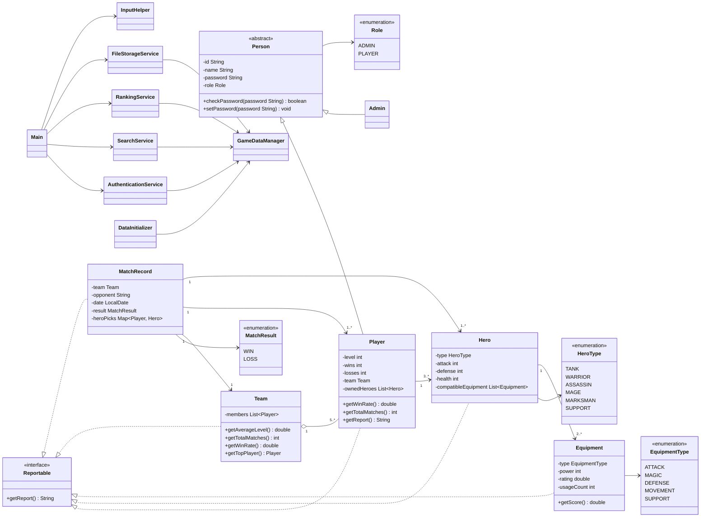

# Honor of Kings IMS - Core Project Plan

## 1. Project Goal

This project implements the core requirements of an AI-assisted Information Management System for Honor of Kings. The system is a Java console application with two user roles: Admin and Player.

Admins can log in, view public information, and manage system data. Players can log in, view their own information, edit limited personal information, view their heroes and match history, and view public player, hero, team, equipment, and leaderboard information.

This version focuses only on completing all basic coursework requirements. Extra-credit features are intentionally postponed until the core system, documentation, AI evidence, Git evidence, and testing evidence are complete.

## 2. Requirement Analysis

The core system covers all required features from the coursework PDF.

### 2.1 Player Lookup

Search a player by ID or name and display:

- player ID and name;
- team;
- level and win rate;
- owned heroes;
- each hero's compatible equipment.

### 2.2 Team Overview

Search a team by ID or name and display:

- team name;
- all members;
- average level;
- total matches;
- win rate;
- top player.

### 2.3 Hero Details

Search a hero by ID or name and display:

- hero name and hero type;
- attack, defense, and health;
- compatible equipment;
- players who own the hero.

### 2.4 Equipment Statistics

Rank equipment using this documented score:

```text
score = usageCount * 2 + rating + power / 100
```

### 2.5 Match History

Retrieve the last N matches for a player or team and display:

- opponent;
- date;
- result;
- heroes picked;
- win/loss record;
- hero pick information.

### 2.6 Leaderboard

Display top X players by:

- win rate;
- level;
- number of matches.

Tie handling uses win rate, then level, then name where needed.

### 2.7 Data Management

Admin users can manage:

- players;
- heroes;
- equipment;
- teams;
- match records.

The core version includes centralized data management in `GameDataManager` and an admin menu for role-protected operations.

Player users can:

- view their own information;
- edit limited personal information;
- view their heroes and match history;
- view public hero, team, equipment, and leaderboard information.

### 2.8 Authentication

The system includes:

- Admin login;
- Player login;
- logout;
- current-user tracking;
- role-based permission checks.

### 2.9 Initial Dataset

The core dataset contains:

- 3 teams, each with 5 players;
- 15 players, each owning at least 3 heroes;
- 15 heroes, each able to use at least 2 equipment items;
- 20 equipment items;
- 10 match records.

## 3. Java Concepts Used

- Inheritance: `Player` and `Admin` extend abstract `Person`.
- Encapsulation: fields are private and accessed through methods.
- Association: `Player` owns heroes; `Hero` uses equipment.
- Aggregation: `Team` contains players.
- Interface: `Reportable` is used by reportable domain classes.
- Polymorphism: the logged-in user is stored as `Person`.
- Collections: `List`, `Map`, `ArrayList`, and `LinkedHashMap` store system data.
- Exception handling: invalid input, duplicate IDs, validation errors, and file output errors are handled.
- File I/O: `FileStorageService` writes a system data summary file.
- Enums: `Role`, `HeroType`, `EquipmentType`, and `MatchResult`.

## 4. Class Design

- `Main`: console menu and application entry point.
- `Person`: abstract superclass for users.
- `Player`: game player with level, win/loss data, team, and heroes.
- `Admin`: user with management permission.
- `Hero`: playable hero with type, stats, and compatible equipment.
- `Equipment`: item with type, power, rating, usage count, and score.
- `Team`: group of players with team statistics.
- `MatchRecord`: match result with opponent, date, result, and hero picks.
- `GameDataManager`: central storage and data-management service.
- `AuthenticationService`: login, logout, and current-user state.
- `SearchService`: player, team, hero, owner, and match-history search.
- `RankingService`: player leaderboard and equipment ranking.
- `FileStorageService`: file output for data summary.
- `DataInitializer`: required initial dataset.
- `InputHelper`: console input helper.

## 5. Core UML Design

The standalone UML file is stored in the project root as `UML.md`.



## 6. Data Design

Data is created by `DataInitializer` and stored in `GameDataManager`.

`GameDataManager` uses:

- `Map<String, Person>` for all users;
- `Map<String, Player>` for players;
- `Map<String, Admin>` for admins;
- `Map<String, Hero>` for heroes;
- `Map<String, Equipment>` for equipment;
- `Map<String, Team>` for teams;
- `List<MatchRecord>` for match records.

File I/O is provided by `FileStorageService`, which saves a readable data summary.

## 7. AI Usage Plan

The project uses AI as documented support, not as hidden authorship.

Required AI roles:

- Architect Agent: class design, UML, and package structure.
- Implementation Agent: selected Java methods and menu/service implementation.
- Testing/Reviewer Agent: bug finding, test-case suggestions, and review.

Evidence files:

- `ai/prompts.md`;
- `ai/agent-log.md`;
- `ai/reflection.md`.

## 8. Prompt Strategy

Prompts will:

- include the relevant requirement or code context;
- ask for one focused task at a time;
- avoid asking AI to generate the whole project at once;
- record accepted, modified, and rejected AI suggestions;
- include related Git commit hashes where possible.

AI-assisted code will be compiled, tested, and manually reviewed.

## 9. Development Timeline

- Stage 1: Read requirements and create project structure.
- Stage 2: Write `docs/plan.md` and core UML.
- Stage 3: Implement model classes and enums.
- Stage 4: Implement services and sample data.
- Stage 5: Implement console menu and authentication.
- Stage 6: Implement player lookup, team overview, hero details, equipment statistics, match history, and leaderboard.
- Stage 7: Implement admin/player permission handling and data management.
- Stage 8: Add file output.
- Stage 9: Write `docs/design.md`, `README.md`, and AI evidence files.
- Stage 10: Write `docs/test-cases.md`.
- Stage 11: Run final tests and fix bugs.
- Stage 12: Export `git-history.txt`.

## 10. Testing Plan

At least 10 manual test cases will be documented in `docs/test-cases.md`.

Planned tests:

- valid admin login;
- invalid login;
- valid player login;
- player lookup by ID;
- player lookup by name;
- team overview;
- hero details;
- equipment statistics;
- player match history;
- team match history;
- leaderboard;
- player self-edit;
- admin data management;
- non-admin permission blocking;
- save data summary.

Each test case will include test ID, function tested, input, expected output, actual output, result, and bug notes.

## 11. Risk Analysis

- Risk: Too much logic in `Main`.
  Mitigation: keep data and business logic in service classes.

- Risk: AI-generated code may be incorrect.
  Mitigation: compile, test, and manually review all AI-assisted code.

- Risk: Git evidence may be weak.
  Mitigation: use meaningful commits with required prefixes.

- Risk: Data management may miss edge cases.
  Mitigation: validate duplicate IDs, missing records, and invalid input.

- Risk: File I/O may fail.
  Mitigation: catch file errors and show clear messages.

## 12. Final Reflection Placeholder

The final reflection will be written in `ai/reflection.md` and will answer the required coursework questions:

1. Which AI tools or models were used?
2. Which prompt was most useful and why?
3. Which AI suggestion was wrong, incomplete, or misleading?
4. How was AI-generated code checked?
5. What bugs were fixed manually?
6. What Java concept became clearer?
7. What Java concept remains uncertain?
8. Did AI make the project easier, harder, or both?
9. Which parts were mainly written by the student?
10. Which parts were mainly generated or heavily assisted by AI?

## 13. Minimum Passing Checklist Mapping

- Program runs.
- Required classes exist.
- At least 10 players exist.
- At least 15 heroes exist.
- At least 20 equipment items exist.
- At least 3 teams exist.
- At least 10 match records exist.
- Menu system works.
- Player lookup works.
- Team overview works.
- Hero details work.
- Equipment statistics work.
- Match history works.
- Leaderboard works.
- Admin/player login works.
- `docs/plan.md` exists and is detailed.
- AI evidence files exist.
- Git evidence is exported.
- Testing document is included.

## 14. Submission Structure

```text
src/
docs/
  plan.md
  design.md
  test-cases.md
ai/
  prompts.md
  agent-log.md
  reflection.md
UML.md
README.md
git-history.txt
```
